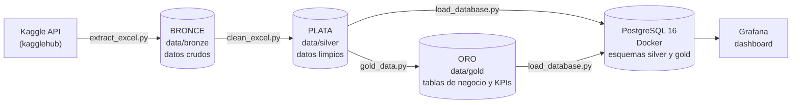

# Mermas en franquicias de comida rápida en Colombia: pipeline ETL

> **Lo que no se vende hoy, se bota.** Pipeline ETL con arquitectura medallón (bronce, plata y oro) que extrae, limpia, modela y carga en PostgreSQL datos de ventas y de desperdicio de alimentos, para calcular los KPIs de merma de una cadena de franquicias de comida rápida y visualizarlos en Grafana.

**Proyecto ETL 2026 · Universidad Autónoma de Occidente**

**Equipo:** Erika Alejandra Echeverry Mora · Laura Victoria Gallo Payana · Juan David Acosta

---

## Tabla de contenido

1. [Contexto y problema](#1-contexto-y-problema)
2. [Usuario y KPIs](#2-usuario-y-kpis)
3. [Fuentes de datos](#3-fuentes-de-datos)
4. [Arquitectura del pipeline](#4-arquitectura-del-pipeline)
5. [Estructura del repositorio](#5-estructura-del-repositorio)
6. [Tecnologías](#6-tecnologías)
7. [Instalación paso a paso](#7-instalación-paso-a-paso)
8. [Ejecución](#8-ejecución)
9. [Detalle de cada etapa](#9-detalle-de-cada-etapa)
10. [Diccionario de datos](#10-diccionario-de-datos)
11. [Definición y cálculo de los KPIs](#11-definición-y-cálculo-de-los-kpis)
12. [Base de datos PostgreSQL](#12-base-de-datos-postgresql)
13. [Visualización en Grafana](#13-visualización-en-grafana)
14. [Resultados y hallazgos](#14-resultados-y-hallazgos)
15. [Configuración](#15-configuración)
16. [Logs y trazabilidad](#16-logs-y-trazabilidad)
17. [Solución de problemas](#17-solución-de-problemas)
18. [Limitaciones y próximos pasos](#18-limitaciones-y-próximos-pasos)
19. [Correspondencia con los criterios del proyecto](#19-correspondencia-con-los-criterios-del-proyecto)
20. [Créditos de los datos](#20-créditos-de-los-datos)

---

## 1. Contexto y problema

El sector de franquicias de comida rápida en Colombia crece de forma constante, pero opera bajo **estrictos estándares de frescura**: los productos preparados no se pueden almacenar de un día para otro. Lo que no se vende ese mismo día se convierte en **merma**, es decir, insumos ya pagados que terminan en la basura.

La demanda fluctúa por factores como el **clima**, la **movilidad urbana** y los **días de quincena**. Cuando la producción no anticipa esas fluctuaciones, aparecen ineficiencias en la cadena de suministro y mermas masivas de alimentos perecederos.

**Objetivo del proyecto:** construir un pipeline de datos reproducible que transforme datos de ventas en información para planear la producción, medir la merma y ubicar dónde se concentra el desperdicio.

**Preguntas que guían el análisis:**

- ¿En qué días y franjas horarias se concentra la demanda, y cuánto varía?
- ¿Qué productos tienen una demanda más irregular y, por lo tanto, mayor riesgo de merma?
- ¿Qué categorías y productos concentran el costo de la merma?
- ¿Cómo se ubica Colombia frente al mundo en desperdicio de alimentos en el servicio de comidas?

---

## 2. Usuario y KPIs

### Perfil del usuario

**Gerente de Operaciones y Abastecimiento** de una cadena de franquicias de comida rápida en Colombia. Su trabajo es controlar los costos de inventario, minimizar el desperdicio y mantener el margen frente a la volatilidad de precios de los insumos. Necesita saber **cuánto preparar, cuándo y de qué**.

### KPIs definidos

| KPI | Qué responde | Fórmula (ver [sección 11](#11-definición-y-cálculo-de-los-kpis)) |
|---|---|---|
| **Costo de Merma sobre Venta (CMV)** | ¿Qué parte del dinero vendido se pierde en insumos botados? | `costo de merma / venta × 100` |
| **Tasa de Desviación de Demanda** | ¿Qué tanto se aleja lo preparado de lo que realmente se vendió? | `Σ \|preparado − demanda\| / Σ demanda × 100` |
| **Costo por Categoría de Insumo Desperdiciado** | ¿Dónde se concentra el desperdicio? | `costo de merma de la categoría / costo total de merma × 100` |

---

## 3. Fuentes de datos

### Fuentes usadas en esta versión

Mientras se consiguen los datos reales de una franquicia colombiana, el pipeline se construyó y probó con dos datasets públicos de Kaggle, descargados por API con la librería `kagglehub`:

| # | Dataset (Kaggle) | Contenido | Tamaño | Uso en el proyecto |
|---|---|---|---|---|
| 1 | `rajatsurana979/fast-food-sales-report` | Transacciones de ventas de un restaurante de comida rápida | 1000 filas × 10 columnas | Fuente principal: demanda por día, franja y producto |
| 2 | `joebeachcapital/food-waste` | Benchmark de desperdicio de alimentos por país (UNEP Food Waste Index) | 214 filas × 12 columnas | Contexto: ubicar a Colombia frente a su región y al mundo |

**Limitaciones conocidas de estas fuentes:**

- El dataset de ventas corresponde a un restaurante de comida callejera de India (productos como *Aalopuri* o *Vadapav*), no a una franquicia colombiana.
- Tiene apenas 1000 transacciones en un año (unas 2,7 órdenes al día), muy por debajo del volumen de una franquicia real.
- No trae datos de producción, mermas ni costos de insumos, así que **la merma se simula** (ver [sección 9.3](#93-transform-plata--oro-gold_datapy)).
- El valor del benchmark para Colombia tiene una confianza de estimación **"Very Low"**: es un valor extrapolado, no medido.

### Fuentes previstas para la operación real

El pipeline está diseñado para incorporar estas fuentes cuando estén disponibles:

| Fuente | Sistema / formato | Frecuencia |
|---|---|---|
| Ventas y mermas | ERP / SQL | Diaria |
| Clientes y fidelización | CRM / CSV | Semanal |
| Apps de delivery (logs) | API / JSON | Tiempo real |
| Variables climáticas | API IDEAM u Open-Meteo | Diaria |
| Encuestas de satisfacción | Formularios | Mensual |

---

## 4. Arquitectura del pipeline

El proyecto sigue una **arquitectura medallón**: cada capa deja los datos más limpios y útiles que la anterior, y cada una queda guardada para poder reprocesar desde cualquier punto.



| Capa | Carpeta | Contenido | Script responsable |
|---|---|---|---|
| **Bronce** | `data/bronze/` | Archivos tal como llegan de la fuente; no se editan nunca | `src/extract/extract_excel.py` |
| **Plata** | `data/silver/` | Una tabla limpia por fuente: tipos correctos, sin duplicados, nulos tratados, columnas de calendario | `src/transform/clean_excel.py` |
| **Oro** | `data/gold/` | Tablas de negocio listas para análisis: hechos diarios, variabilidad, KPIs | `src/transform/gold_data.py` |
| **Base de datos** | PostgreSQL | Plata y oro cargadas en esquemas separados, con claves primarias | `src/load/load_database.py` |
| **Visualización** | Grafana | Dashboard que consulta directamente las tablas de oro | `grafana/` |

Todo el flujo se orquesta con **`main.py`**: un solo comando ejecuta las cuatro etapas, en unos 5 segundos.

---

## 5. Estructura del repositorio

```
proyectofinaletl/
├── config/
│   └── config.yaml              # Rutas, supuestos de la simulación y opciones de carga
├── data/
│   ├── bronze/                  # Capa bronce: CSV originales (respaldo de la extracción)
│   │   ├── fast_food_sales_report.csv
│   │   └── food_Waste.csv
│   ├── silver/                  # Capa plata: generada por clean_excel.py
│   │   ├── ventas_silver.csv
│   │   └── benchmark_silver.csv
│   └── gold/                    # Capa oro: generada por gold_data.py (9 tablas)
├── grafana/
│   ├── dashboards/
│   │   └── mermas_dashboard.json            # Dashboard (13 visualizaciones)
│   └── provisioning/
│       ├── dashboards/dashboards.yml        # Carga automática del dashboard
│       └── datasources/postgres.yml         # Conexión automática a PostgreSQL
├── logs/
│   └── logs.txt                 # Registro de cada ejecución del pipeline
├── notebooks/
│   └── eda.ipynb                # Análisis exploratorio (pandas + Matplotlib)
├── src/
│   ├── __init__.py
│   ├── extract/
│   │   ├── __init__.py
│   │   └── extract_excel.py     # EXTRACT: Kaggle API → bronce
│   ├── transform/
│   │   ├── __init__.py
│   │   ├── clean_excel.py       # TRANSFORM: bronce → plata
│   │   └── gold_data.py         # TRANSFORM: plata → oro (tablas de negocio y KPIs)
│   └── load/
│       ├── __init__.py
│       └── load_database.py     # LOAD: plata y oro → PostgreSQL
├── tests/                       # Reservado para pruebas automáticas (pendiente)
├── .env                         # Credenciales (NO se sube al repositorio)
├── .env.example                 # Plantilla de variables de entorno
├── .gitignore
├── docker-compose.yml           # PostgreSQL 16 + Grafana
├── main.py                      # Orquestador del pipeline completo
├── README.md
└── requirements.txt
```

---

## 6. Tecnologías

| Componente | Tecnología | Para qué se usa |
|---|---|---|
| Lenguaje | Python 3.10 o superior (probado con 3.14) | Todo el pipeline |
| Extracción | `kagglehub` | Descarga de datasets por API |
| Procesamiento | `pandas`, `numpy` | Limpieza, transformación y agregaciones |
| Análisis exploratorio | Jupyter (`ipykernel`), `matplotlib` | Notebook de EDA y gráficas |
| Configuración | `pyyaml`, `python-dotenv` | Lectura de `config.yaml` y `.env` |
| Conexión a base de datos | `SQLAlchemy`, `psycopg2-binary` | Carga a PostgreSQL |
| Base de datos | PostgreSQL 16 | Almacenamiento de las capas plata y oro |
| Contenedores | Docker y Docker Compose | PostgreSQL y Grafana reproducibles |
| Visualización | Grafana 12 | Dashboard de KPIs y demanda |
| Otros | `openpyxl` | Lectura de archivos Excel si la fuente lo requiere |

---

## 7. Instalación paso a paso

Las instrucciones están escritas para **Windows con PowerShell** (el entorno del equipo). En macOS o Linux, los comandos equivalentes se indican cuando cambian.

### 7.1 Requisitos previos

- [Python](https://www.python.org/downloads/) 3.10 o superior
- [Docker Desktop](https://www.docker.com/products/docker-desktop/) (incluye Docker Compose)
- [Git](https://git-scm.com/)
- Opcional: [VS Code](https://code.visualstudio.com/) con la extensión de Python y Jupyter
- Opcional: una cuenta de [Kaggle](https://www.kaggle.com/), si la descarga por API pide autenticación

### 7.2 Clonar el repositorio

```powershell
git clone <https://github.com/VictoriaGallo/pyectofinaletl.git>
cd proyectofinaletl
```

### 7.3 Crear y activar el entorno virtual

> ⚠️ **Cada integrante debe crear su propio entorno virtual.** Un `venv` copiado de otro computador no funciona, porque guarda la ruta del Python de la máquina donde se creó.

```powershell
python -m venv venv
```

Si PowerShell bloquea la activación con el error *"la ejecución de scripts está deshabilitada en este sistema"*, ejecuta **una sola vez**:

```powershell
Set-ExecutionPolicy -ExecutionPolicy RemoteSigned -Scope CurrentUser
```

Luego activa el entorno:

```powershell
.\venv\Scripts\Activate.ps1
```

En macOS o Linux: `source venv/bin/activate`.

Sabrás que está activo porque la línea de la terminal empieza con `(venv)`.

### 7.4 Instalar las dependencias

```powershell
pip install -r requirements.txt
```

Contenido esperado de `requirements.txt`:

```
pandas
kagglehub
openpyxl
pyyaml
python-dotenv
matplotlib
ipykernel
sqlalchemy
psycopg2-binary
```

### 7.5 Configurar las variables de entorno

Copia la plantilla y edita los valores:

```powershell
Copy-Item .env.example .env
```

Contenido del `.env`:

```env
# PostgreSQL (lo usan load_database.py, docker-compose.yml y Grafana)
DB_HOST=localhost
DB_PORT=5432
DB_NAME=mermas_etl
DB_USER=postgres
DB_PASSWORD=cambiar_por_una_contraseña

# Grafana (opcionales; si no se definen, el usuario y la contraseña son admin)
GRAFANA_PORT=3000
GRAFANA_USER=admin
GRAFANA_PASSWORD=cambiar_por_una_contraseña
```

> 🔒 El archivo `.env` contiene credenciales y **nunca** debe subirse al repositorio; debe estar listado en `.gitignore`. Al repositorio solo se sube `.env.example`, sin contraseñas reales.
>
> Evita el símbolo `$` en las contraseñas: Docker Compose lo interpreta como una variable.

### 7.6 Levantar PostgreSQL y Grafana con Docker

Con Docker Desktop abierto, desde la raíz del proyecto:

```powershell
docker compose up -d
docker compose ps
```

Espera a que el servicio `postgres` muestre el estado **`healthy`**. Para confirmar que Docker tomó las variables del `.env`:

```powershell
docker compose config
```

> 💡 **Puerto ocupado:** si ya tienes PostgreSQL instalado en Windows u otro contenedor usando el puerto 5432, cambia `DB_PORT` en el `.env` (por ejemplo a `5434`) y ejecuta de nuevo `docker compose up -d`. Lo mismo aplica a `GRAFANA_PORT` si el 3000 está ocupado. Para revisar si un puerto está libre: `netstat -ano | findstr :5434` (si no imprime nada, está libre).

---

## 8. Ejecución

### 8.1 Pipeline completo

Con el entorno virtual activado y Docker corriendo:

```powershell
python main.py
```

| Comando | Qué hace |
|---|---|
| `python main.py` | Pipeline completo: extract → plata → oro → PostgreSQL |
| `python main.py --sin-carga` | Extract y transform, sin tocar la base de datos |
| `python main.py --solo-carga` | Solo carga a PostgreSQL lo que ya existe en `data/silver` y `data/gold` |

Una ejecución correcta termina con estas líneas:

```
... | INFO | src.load.load_database | Verificación OK: 11 tablas con el número de filas esperado
... | INFO | pipeline | ========== Pipeline terminado en 5.0 s ==========
```

### 8.2 Ejecutar una etapa por separado

Cada módulo se puede ejecutar de forma independiente desde la raíz del proyecto:

```powershell
python -m src.extract.extract_excel       # Solo extracción
python -m src.transform.clean_excel       # Extracción + capa plata
python -m src.transform.gold_data         # Capa oro (lee data/silver)
python -m src.load.load_database          # Carga a PostgreSQL (lee data/silver y data/gold)
```

> Se usa `python -m` con puntos y sin `.py`. Así Python reconoce el paquete `src`. Los scripts también funcionan con el botón de Play de VS Code.

### 8.3 Análisis exploratorio

Abre `notebooks/eda.ipynb` en VS Code o Jupyter, selecciona el kernel del entorno `venv` y ejecuta **Run All**. El notebook se ubica solo en la raíz del proyecto para que las rutas e imports funcionen.

### 8.4 Dashboard

Abre `http://localhost:3000` (o el puerto definido en `GRAFANA_PORT`) e ingresa con el usuario y la contraseña de Grafana. El dashboard **"Mermas en franquicias de comida rápida"** abre como página de inicio.

---

## 9. Detalle de cada etapa

### 9.1 Extract: fuentes → bronce (`extract_excel.py`)

**Funciones principales:** `extraer_ventas_referencia()`, `extraer_benchmark_pais()` y `leer_archivo()`.

1. Descarga cada dataset desde Kaggle con `kagglehub`.
2. **Respaldo:** si la descarga falla por red o autenticación, lee la copia local en `data/bronze/`. Así el pipeline sigue funcionando sin conexión.
3. **Normaliza los nombres de las columnas al español**, para que el resto del pipeline trabaje con un vocabulario único.

Equivalencia de columnas del dataset de ventas:

| Columna original | Columna normalizada |
|---|---|
| `order_id` | `id_orden` |
| `date` | `fecha` |
| `item_name` | `nombre_item` |
| `item_type` | `tipo_item` |
| `item_price` | `precio_unitario` |
| `quantity` | `cantidad` |
| `transaction_amount` | `monto_transaccion` |
| `transaction_type` | `tipo_pago` |
| `received_by` | `genero_cajero` |
| `time_of_sale` | `franja_horaria` |

La extracción **no modifica los valores**: las fechas, los nulos y los tipos se dejan tal como vienen, porque su tratamiento es responsabilidad de la capa plata.

### 9.2 Transform: bronce → plata (`clean_excel.py`)

Cada decisión de limpieza sale del diagnóstico hecho en el EDA:

| # | Problema detectado en el EDA | Decisión en plata |
|---|---|---|
| 1 | Textos con espacios sobrantes o vacíos | Se quitan los espacios y los textos vacíos pasan a nulo |
| 2 | Posibles duplicados | Se eliminan duplicados exactos y por `id_orden` (resultado: 0 y 0) |
| 3 | Tipos numéricos inconsistentes | `id_orden`, `precio_unitario`, `cantidad` y `monto_transaccion` pasan a numéricos |
| 4 | **Fechas en tres formatos mezclados** | Conversión con detección automática del formato (ver abajo) |
| 5 | Filas sin fecha válida | Se eliminan y se registran en el log (resultado: 0) |
| 6 | Precio o cantidad nulos, cero o negativos | Se eliminan y se registran en el log (resultado: 0) |
| 7 | Coherencia `monto = precio × cantidad` | Si no cuadra, se recalcula el monto y queda en el log (resultado: todas cuadran) |
| 8 | `tipo_pago` con 107 nulos (10,7 %) | Se etiquetan como `"Desconocido"`: borrarlos haría perder el 10 % de las ventas, y el tipo de pago no interviene en los KPIs |
| 9 | Franjas horarias fuera de catálogo | Se reportan en el log |
| 10 | `genero_cajero` no aporta al problema de mermas | Se elimina la columna |
| 11 | Faltan variables de calendario para el análisis | Se agregan `anio`, `mes`, `dia_semana`, `es_fin_de_semana` y `es_quincena` |

**Los montos altos no se tratan como errores:** el boxplot muestra valores atípicos entre 750 y 900, pero 900 = 60 × 15 (precio máximo por cantidad máxima). Son pedidos grandes legítimos, así que se conservan.

#### El caso de las fechas

El EDA encontró tres formatos de fecha en la misma columna:

| Patrón | Ejemplo | Filas | Interpretación |
|---|---|---|---|
| `9/99/9999` | `8/23/2022` | 438 | Mes/día (no existe un mes 23) |
| `99/99/9999` | `11/20/2022` | 159 | Mes/día (no existe un mes 20) |
| `99-99-9999` | `07-03-2022` | 403 | **Ambiguo:** ¿3 de julio o 7 de marzo? |

Para resolver la ambigüedad, el script aplica tres reglas en orden:

1. Si algún primer número es mayor que 12, no puede ser mes: el formato es día-mes.
2. Si algún segundo número es mayor que 12, el formato es mes-día.
3. Si ninguna regla decide, elige el formato que deja más fechas dentro del rango de las fechas con barra, que no son ambiguas.

En los datos reales, **ninguna de las 403 fechas con guion tiene un número mayor que 12** en ninguna posición, así que decidió la regla 3: mes-día (376 fechas dentro del rango, frente a 231 con día-mes).

> 🔎 **Hallazgo:** 403 de 1000 es el 40,3 %, casi exactamente la proporción de días del 1 al 12 en un mes (12 / 30,4 = 39,5 %). Lo más probable es que el archivo original tuviera todas las fechas en formato mes/día y que se abriera en un Excel configurado en día/mes. Excel convirtió al revés todas las fechas que podía (día ≤ 12) y dejó como texto las demás. Con la interpretación mes-día, las 1000 ventas caen exactamente entre el **1 de abril de 2022 y el 30 de marzo de 2023**, un año completo.

#### Definición de quincena

`es_quincena` es verdadero el día 15, el último día de cada mes y el día siguiente a cada uno, porque en Colombia el pago de nómina suele hacerse el 15 y el último día del mes. La cantidad de días posteriores se ajusta en la constante `DIAS_DESPUES_DE_PAGO`.

#### Benchmark

En el benchmark se limpian los textos, se convierten las columnas numéricas, se eliminan los países duplicados y se agrega `nivel_confianza` (de 1 = *Very Low* a 4 = *High*), para poder filtrar las estimaciones poco confiables.

**Salida:** `data/silver/ventas_silver.csv` (1000 filas) y `data/silver/benchmark_silver.csv` (214 filas).

### 9.3 Transform: plata → oro (`gold_data.py`)

La capa oro tiene dos grupos de tablas.

**Con datos reales:**

| Tabla | Granularidad | Para qué sirve |
|---|---|---|
| `hechos_demanda_diaria` | Un día × un ítem (364 × 7 = 2548 filas) | Tabla de hechos base. **Incluye los días sin ventas en cero** (67,7 % de las filas). |
| `demanda_dia_franja` | Día de la semana × franja (35 filas) | Patrones de demanda para planear la producción |
| `variabilidad_item` | Un ítem (7 filas) | Media, desviación y coeficiente de variación de la demanda diaria |
| `ventas_mensuales` | Un mes (12 filas) | Tendencia y ticket promedio |
| `efecto_calendario` | Tipo de día (4 filas) | Demanda en quincena y fin de semana frente al resto de días |
| `benchmark_contexto` | Referencia (4 filas) | Colombia frente a su región, la mediana mundial y la mediana de los países con estimación confiable |

> **¿Por qué incluir los días sin ventas?** Si solo se cuentan los días con ventas, la variabilidad se subestima. Además, para la merma, un día en que se preparó comida y no se vendió nada es justamente merma total.

**Con merma simulada:**

Las fuentes actuales no traen producción ni costos, así que `simular_merma()` aplica una política de producción razonable:

1. **Pronóstico:** promedio de las unidades vendidas el mismo día de la semana en las últimas 4 semanas.
2. **Producción:** se prepara el pronóstico más un 10 % de colchón de seguridad, redondeado hacia arriba.
3. **Merma:** lo preparado que no se vende ese día; no se puede guardar para el día siguiente.
4. **Costo:** el insumo cuesta el 35 % del precio de venta.
5. **Venta perdida:** si la demanda supera lo preparado, la diferencia se registra como demanda insatisfecha.

La primera semana se excluye porque no tiene historia para pronosticar (49 filas). Los supuestos se cambian en `config/config.yaml`, sección `simulacion`, sin tocar el código. **Cuando existan datos reales de producción y costos, solo hay que reemplazar la función `simular_merma()`.**

| Tabla | Contenido |
|---|---|
| `merma_simulada_diaria` | Demanda, pronóstico, preparado, vendido, merma y costos por día e ítem (2499 filas) |
| `kpis_simulados_resumen` | Los tres KPIs: total, por categoría y por ítem (10 filas) |
| `kpis_simulados_mensual` | Los KPIs por mes (12 filas) |

### 9.4 Load: plata y oro → PostgreSQL (`load_database.py`)

1. Crea la base de datos de `DB_NAME` si no existe.
2. Crea un **esquema por capa** (`silver` y `gold`), para que la base también refleje la arquitectura medallón.
3. Carga cada CSV como una tabla. El sufijo de capa se quita del nombre: `ventas_silver.csv` → `silver.ventas`.
4. Convierte la columna `fecha` al tipo `DATE`.
5. Agrega una columna `fecha_carga` con el momento de la carga, para trazabilidad.
6. Crea la **clave primaria** de cada tabla, lo que de paso valida que no haya duplicados.
7. **Verifica la carga:** compara las filas de cada tabla en la base con las filas cargadas.

Modos de carga (`config.yaml` → `base_de_datos.modo_carga`):

- `replace` (predeterminado): borra y recarga cada tabla en cada ejecución.
- `append`: agrega filas a las tablas existentes.

### 9.5 Orquestación (`main.py`)

`main.py` ejecuta las etapas en orden, lee `config.yaml`, configura el log, mide el tiempo total y detiene el pipeline con un mensaje claro si alguna etapa falla (código de salida 1).

---

## 10. Diccionario de datos

### `silver.ventas`

| Columna | Tipo | Descripción |
|---|---|---|
| `id_orden` | entero | Identificador de la orden **(PK)** |
| `fecha` | fecha | Fecha de la venta |
| `nombre_item` | texto | Producto vendido |
| `tipo_item` | texto | Categoría: `Fastfood` o `Beverages` |
| `precio_unitario` | número | Precio por unidad |
| `cantidad` | entero | Unidades vendidas en la orden |
| `monto_transaccion` | número | Precio unitario × cantidad |
| `tipo_pago` | texto | `Cash`, `Online` o `Desconocido` |
| `franja_horaria` | texto | `Morning`, `Afternoon`, `Evening`, `Night` o `Midnight` |
| `anio`, `mes` | entero | Año y mes de la venta |
| `dia_semana` | texto | `Lun` a `Dom` |
| `es_fin_de_semana` | booleano | Sábado o domingo |
| `es_quincena` | booleano | Día de pago (15 o último día del mes) o el día siguiente |
| `fecha_carga` | timestamp | Momento de la carga a PostgreSQL |

### `silver.benchmark`

| Columna | Descripción |
|---|---|
| `pais` | País **(PK)** |
| `total_kg_percapita_anio` | Desperdicio total, en kg por persona al año |
| `hogar_kg_percapita_anio`, `hogar_toneladas_anio` | Desperdicio en hogares |
| `comercio_kg_percapita_anio`, `comercio_toneladas_anio` | Desperdicio en comercio minorista |
| `servicio_alimentos_kg_percapita_anio`, `servicio_alimentos_toneladas_anio` | Desperdicio en servicio de alimentos (el más relevante para franquicias) |
| `confianza_estimacion` | Confianza de la estimación según la UNEP |
| `nivel_confianza` | 1 = Very Low, 2 = Low, 3 = Medium, 4 = High |
| `codigo_m49`, `region` | Código y región de la ONU |
| `fuente` | Enlace a la fuente |

### Tablas de la capa oro (esquema `gold`)

| Tabla | Clave primaria | Columnas principales |
|---|---|---|
| `hechos_demanda_diaria` | `fecha`, `nombre_item` | `ordenes`, `unidades`, `monto`, `tipo_item`, `precio_unitario`, `periodo`, `dia_semana`, `es_fin_de_semana`, `es_quincena` |
| `demanda_dia_franja` | `dia_semana`, `franja_horaria` | `ordenes`, `unidades`, `monto`, `dias_en_periodo`, `promedio_unidades_por_dia` |
| `variabilidad_item` | `nombre_item` | `dias_con_venta`, `pct_dias_con_venta`, `media_diaria`, `desv_diaria`, `cv`, `participacion_monto_pct`, `ranking_variabilidad` |
| `ventas_mensuales` | `periodo` | `ordenes`, `unidades`, `monto`, `ticket_promedio` |
| `efecto_calendario` | `variable`, `grupo` | `dias`, `promedio_unidades_diarias`, `promedio_monto_diario`, `diferencia_vs_resto_pct` |
| `benchmark_contexto` | `referencia` | `n_paises`, `nivel_confianza` y los kg por persona de cada sector |
| `merma_simulada_diaria` | `fecha`, `nombre_item` | `demanda`, `pronostico`, `preparado`, `vendido`, `merma_unidades`, `demanda_insatisfecha`, `desviacion_abs`, `venta_simulada`, `costo_merma`, `venta_perdida` |
| `kpis_simulados_resumen` | `nivel`, `clave` | `cmv_pct`, `tasa_desviacion_pct`, `tasa_merma_pct`, `participacion_costo_merma_pct` y los totales de unidades y costos |
| `kpis_simulados_mensual` | `periodo` | Los mismos KPIs por mes |

Todas las tablas incluyen además la columna `fecha_carga`.

---

## 11. Definición y cálculo de los KPIs

| KPI | Fórmula | Interpretación |
|---|---|---|
| **CMV** | `Σ costo_merma / Σ venta_simulada × 100` | Porcentaje de la venta que se pierde en insumos botados. Más bajo es mejor. |
| **Tasa de Desviación de Demanda** | `Σ \|preparado − demanda\| / Σ demanda × 100` | Error de la planeación, en ambas direcciones (de más y de menos). |
| **Tasa de merma** (complementario) | `Σ merma_unidades / Σ preparado × 100` | Porcentaje de lo preparado que termina en la basura. |
| **Costo por categoría** | `costo_merma de la categoría / costo_merma total × 100` | Dónde se concentra el desperdicio. |

Donde, para cada día e ítem:

```
costo_unitario_insumo = precio_unitario × porcentaje_costo_insumo     (0,35)
preparado             = ⌈ pronóstico × (1 + colchón_seguridad) ⌉      (colchón = 0,10)
vendido               = mín(demanda, preparado)
merma_unidades        = preparado − vendido
costo_merma           = merma_unidades × costo_unitario_insumo
venta_simulada        = vendido × precio_unitario
```

---

## 12. Base de datos PostgreSQL

PostgreSQL 16 corre en Docker (servicio `postgres` en `docker-compose.yml`), con un volumen persistente para que los datos sobrevivan a los reinicios.

```
mermas_etl
├── silver
│   ├── ventas                    (1000 filas)
│   └── benchmark                 (214 filas)
└── gold
    ├── hechos_demanda_diaria     (2548 filas)
    ├── merma_simulada_diaria     (2499 filas)
    ├── demanda_dia_franja        (35 filas)
    ├── ventas_mensuales          (12 filas)
    ├── kpis_simulados_mensual    (12 filas)
    ├── kpis_simulados_resumen    (10 filas)
    ├── variabilidad_item         (7 filas)
    ├── benchmark_contexto        (4 filas)
    └── efecto_calendario         (4 filas)
```

### Conectarse desde pgAdmin u otro cliente

| Campo | Valor |
|---|---|
| Host | `localhost` |
| Puerto | el valor de `DB_PORT` en `.env` |
| Base de datos | `mermas_etl` |
| Usuario / contraseña | `DB_USER` / `DB_PASSWORD` |

Desde la terminal, sin instalar nada adicional:

```powershell
docker exec -it mermas_postgres psql -U postgres -d mermas_etl
```

### Consultas de ejemplo

```sql
-- Verificar las tablas cargadas y sus filas
SELECT table_schema, table_name
FROM information_schema.tables
WHERE table_schema IN ('silver', 'gold')
ORDER BY 1, 2;

-- KPIs totales y por categoría
SELECT nivel, clave, cmv_pct, tasa_desviacion_pct, participacion_costo_merma_pct
FROM gold.kpis_simulados_resumen
WHERE nivel IN ('Total', 'Categoría');

-- Las 5 combinaciones de día y franja con más demanda promedio
SELECT dia_semana, franja_horaria, promedio_unidades_por_dia
FROM gold.demanda_dia_franja
ORDER BY promedio_unidades_por_dia DESC
LIMIT 5;

-- Productos ordenados por irregularidad de la demanda
SELECT nombre_item, pct_dias_con_venta, cv, participacion_monto_pct
FROM gold.variabilidad_item
ORDER BY cv DESC;

-- CMV mensual calculado desde la tabla de hechos de merma
SELECT date_trunc('month', fecha)::date AS mes,
       ROUND((SUM(costo_merma) / NULLIF(SUM(venta_simulada), 0) * 100)::numeric, 2) AS cmv_pct
FROM gold.merma_simulada_diaria
GROUP BY 1
ORDER BY 1;
```

---

## 13. Visualización en Grafana

Grafana 12 corre en Docker (servicio `grafana`) y queda **configurado automáticamente** al levantarse (*provisioning*):

- `grafana/provisioning/datasources/postgres.yml` crea la conexión a PostgreSQL con las mismas credenciales del `.env`. Dentro de Docker, Grafana llega a la base por el nombre del servicio y el puerto interno (`postgres:5432`), no por `localhost` ni por `DB_PORT`.
- `grafana/provisioning/dashboards/dashboards.yml` carga el dashboard desde `grafana/dashboards/`.

### Contenido del dashboard

| Sección | Visualizaciones |
|---|---|
| **KPIs (merma simulada)** | Tarjetas de CMV, Tasa de Desviación de Demanda, % de merma y costo total · CMV y desviación por mes · Costo de merma por categoría (dona) · Costo de merma por ítem |
| **Demanda (datos reales)** | Unidades por día con media móvil de 7 días · Mapa de calor de día × franja · Monto vendido por mes · Variabilidad por ítem · Quincena y fin de semana frente al resto de días |
| **Contexto** | Colombia frente a su región y al mundo (benchmark UNEP) |

El filtro **Ítem** (parte superior) actualiza los KPIs y las gráficas de demanda. El rango de fechas viene configurado entre abril de 2022 y marzo de 2023.

> Para conservar en el repositorio cambios hechos desde la interfaz de Grafana, exporta el dashboard (**Share → Export → Save to file**) y reemplaza `grafana/dashboards/mermas_dashboard.json`.

---

## 14. Resultados y hallazgos

### Calidad de los datos

| Revisión | Resultado |
|---|---|
| Duplicados | 0 exactos y 0 por `id_orden` |
| Fechas sin convertir | 0 de 1000 |
| Nulos | Solo en `tipo_pago`: 107 (10,7 %), etiquetados como `"Desconocido"` |
| Coherencia de montos | Las 1000 filas cuadran con precio × cantidad |
| Periodo cubierto | 1 de abril de 2022 a 30 de marzo de 2023 |
| Carga a PostgreSQL | 11 tablas, todas con clave primaria y verificación de filas OK |

### Hallazgos del análisis

**1. La variación real aparece al cruzar el día y la franja horaria.**

| Comparación | Mínimo | Máximo | Diferencia |
|---|---|---|---|
| Entre franjas horarias | 1540 u (Evening) | 1759 u (Night) | +14 % |
| Entre días de la semana | 1048 u (martes) | 1286 u (domingo) | +23 % |
| Entre combinaciones de día y franja | 135 u (lunes, Evening) | 317 u (domingo, Morning) | **+135 %** |

Planear con promedios por día o por franja esconde casi toda la variación. Como cada celda del cruce tiene unas 28 órdenes, parte de la diferencia puede ser ruido: hay que validarlo con datos reales.

**2. Volumen no es lo mismo que valor.** Las bebidas (*Cold coffee* y *Sugarcane juice*) son los productos más vendidos en unidades, pero *Sandwich* (23,9 %) y *Frankie* (20,9 %) suman el 44,8 % del dinero por su mayor precio.

**3. La demanda de cada producto es muy irregular.** Cada producto se vende solo en el 30 a 35 % de los días, y su coeficiente de variación está entre 1,66 y 1,95:

| Ítem | % de días con venta | Media diaria | CV | % del monto |
|---|---|---|---|---|
| Sandwich | 30,0 % | 3,01 | **1,95** | 23,9 % |
| Aalopuri | 32,4 % | 2,87 | 1,90 | 7,6 % |
| Vadapav | 30,8 % | 2,76 | 1,90 | 7,3 % |
| Frankie | 31,6 % | 3,16 | 1,83 | 20,9 % |
| Panipuri | 32,4 % | 3,37 | 1,80 | 8,9 % |
| Cold coffee | 34,1 % | 3,74 | 1,74 | 19,8 % |
| Sugarcane juice | 35,2 % | 3,51 | 1,66 | 11,6 % |

**4. KPIs de merma simulada.**

| KPI | Valor |
|---|---|
| Costo de Merma sobre Venta (CMV) | 95,29 % |
| Tasa de Desviación de Demanda | 154,80 % |
| Merma (% de lo preparado) | 72,53 % |

> ⚠️ **Estos valores están inflados por el volumen del dataset,** que tiene unas 2,7 órdenes al día para todo el restaurante. Con una demanda tan escasa e irregular, cualquier producción diaria planeada termina mayormente en merma. Lo que se valida aquí es que el pipeline calcula los KPIs correctamente y la comparación entre productos y categorías. Los valores absolutos tendrán sentido con datos de volumen realista.

**5. La merma se concentra en la comida rápida y en el Sandwich.**

| Categoría | % del costo de merma | CMV |
|---|---|---|
| Fastfood | 70,65 % | 101,11 % |
| Beverages | 29,35 % | 83,71 % |

El *Sandwich* concentra el 26,5 % del costo de merma, con el CMV más alto (119,7 %) y la mayor desviación (173,9 %). Los productos más irregulares son también los que más se desvían: *Sandwich* (CV 1,95 → 173,9 %) frente a *Sugarcane juice* (CV 1,66 → 143,1 %).

**6. El benchmark sirve como contexto, no como meta.** Colombia registra 28 kg por persona al año de desperdicio en servicio de alimentos, igual a la mediana mundial. Pero cerca de 130 países comparten ese mismo rango y la confianza de la estimación para Colombia es *Very Low*: es un valor extrapolado, no medido. Por eso no se usa para calcular KPIs.

### Recomendaciones para el usuario

1. **Planear la producción por día y franja**, no con un promedio diario.
2. **Empezar el control de merma por el Sandwich** y la comida rápida.
3. **Registrar la producción y la merma diarias** en el ERP: sin esos datos, el CMV real no se puede medir.
4. **Incorporar el clima y la quincena al pronóstico**, que son variables del problema que aún no están en los datos.

---

## 15. Configuración

### `config/config.yaml`

```yaml
rutas:
  bronze: data/bronze
  silver: data/silver
  gold: data/gold
  logs: logs/logs.txt

simulacion:                       # Supuestos de la merma simulada
  porcentaje_costo_insumo: 0.35   # Costo del insumo como fracción del precio de venta
  colchon_seguridad: 0.10         # Se prepara un 10 % por encima del pronóstico
  semanas_historia: 4             # Semanas usadas para pronosticar

base_de_datos:
  driver: postgresql+psycopg2
  crear_base_si_no_existe: true
  modo_carga: replace             # replace | append
  capas:                          # Capa del proyecto → esquema en PostgreSQL
    silver: silver
    gold: gold
```

### Variables de entorno (`.env`)

| Variable | Obligatoria | Uso |
|---|---|---|
| `DB_HOST` | No (por defecto `localhost`) | Host de PostgreSQL para el pipeline |
| `DB_PORT` | No (por defecto `5432`) | Puerto publicado de PostgreSQL |
| `DB_NAME` | Sí | Nombre de la base de datos |
| `DB_USER` | Sí | Usuario de PostgreSQL |
| `DB_PASSWORD` | Sí | Contraseña de PostgreSQL |
| `GRAFANA_PORT` | No (por defecto `3000`) | Puerto de Grafana |
| `GRAFANA_USER`, `GRAFANA_PASSWORD` | No (por defecto `admin`) | Acceso a Grafana |

> La contraseña de PostgreSQL y la de Grafana se fijan **la primera vez** que arranca cada contenedor. Para cambiarlas después hay que recrear los volúmenes con `docker compose down -v`, lo que **borra los datos**; luego se vuelve a ejecutar `docker compose up -d` y `python main.py`.

---

## 16. Logs y trazabilidad

Cada ejecución queda registrada en la consola y en `logs/logs.txt`, con el formato:

```
fecha y hora | nivel | módulo | mensaje
```

Extracto de una ejecución real:

```
INFO | pipeline | ---- 1. EXTRACT (bronce) ----
INFO | src.extract.extract_excel | Extraídas 1000 filas (kagglehub)
INFO | src.extract.extract_excel | Extraídas 214 filas de benchmark (kagglehub)
INFO | pipeline | ---- 2. TRANSFORM (plata) ----
INFO | src.transform.clean_excel | Duplicados eliminados: 0 exactos, 0 por id_orden
INFO | src.transform.clean_excel | Fechas con guion: 0 con primer número > 12, 0 con segundo número > 12
INFO | src.transform.clean_excel | Formato elegido para fechas con guion: %m-%d-%Y
INFO | src.transform.clean_excel | Fechas: 597 con barra, 403 con guion, 0 otras, 0 sin poder convertir (NaT)
INFO | src.transform.clean_excel | Coherencia de montos: todas las filas cuadran con precio x cantidad.
INFO | src.transform.clean_excel | tipo_pago: 107 nulos etiquetados como 'Desconocido'
INFO | pipeline | ---- 3. TRANSFORM (oro) ----
INFO | src.transform.gold_data | Demanda diaria: 364 días x 7 ítems = 2548 filas (32.3 % con ventas)
INFO | src.transform.gold_data | KPIs SIMULADOS (...): CMV 95.29 % | Desviación de demanda 154.80 % | Merma 72.53 % de lo preparado
INFO | pipeline | ---- 4. LOAD (PostgreSQL) ----
INFO | src.load.load_database | Conectado a PostgreSQL 16.15 en localhost:5434, base 'mermas_etl'
INFO | src.load.load_database | Verificación OK: 11 tablas con el número de filas esperado
INFO | pipeline | ========== Pipeline terminado en 5.0 s ==========
```

Las advertencias (`WARNING`) señalan correcciones automáticas, como montos recalculados, filas eliminadas o valores fuera de catálogo. Los errores (`ERROR`) detienen el pipeline con el detalle completo.

---

## 17. Solución de problemas

| Síntoma | Causa | Solución |
|---|---|---|
| *"La ejecución de scripts está deshabilitada en este sistema"* al activar el `venv` | Política de ejecución de PowerShell | `Set-ExecutionPolicy -ExecutionPolicy RemoteSigned -Scope CurrentUser` |
| *"Fatal error in launcher: Unable to create process using ... python.exe"* | El `venv` se creó en otro computador | Borrar `venv` y crearlo de nuevo (sección 7.3) |
| `ModuleNotFoundError: No module named 'src'` | El script se ejecutó como archivo desde otra carpeta | Ejecutar desde la raíz con `python -m src.transform.clean_excel` |
| `ImportError: cannot import name ...` en el notebook | Un import que no coincide con el módulo | Revisar el import y reiniciar el kernel (**Restart** y **Run All**) |
| Un script corre sin hacer nada | El archivo no está guardado (punto blanco en la pestaña de VS Code) | Guardar con `Ctrl + S` o activar **File → Auto Save** |
| `No such file or directory: 'requirements.txt'` | La terminal está en otra carpeta | Ir a la raíz del proyecto con `cd` |
| `port is already allocated` al levantar Docker | Otro servicio usa el puerto | Cambiar `DB_PORT` o `GRAFANA_PORT` en `.env` |
| El log dice *PostgreSQL 18.x* en lugar de *16.x* | El pipeline se conectó a un PostgreSQL instalado en Windows, no al contenedor | Usar un `DB_PORT` distinto de 5432 para el contenedor |
| `UnicodeDecodeError: 'utf-8' codec can't decode byte...` al conectar | Contraseña o usuario incorrectos (PostgreSQL en español envía el error con tildes) | Revisar `DB_USER` y `DB_PASSWORD` en `.env` |
| `Connection refused` | PostgreSQL no está corriendo | `docker compose up -d` y esperar el estado `healthy` |
| *"No existen [...] en data/silver"* al correr `gold_data.py` | La capa plata no se ha generado | Ejecutar primero `python -m src.transform.clean_excel` |
| Un panel de Grafana dice *"No data"* | Rango de fechas fuera del periodo de los datos | Ajustar el rango a abril de 2022 – marzo de 2023 |
| Los KPIs salen muy altos (CMV cercano al 95 %) | Comportamiento esperado con este dataset (sección 14) | No es un error del código |

---

## 18. Limitaciones y próximos pasos

### Limitaciones

- Los datos de ventas son un **proxy**: un restaurante de comida callejera de India, no una franquicia colombiana.
- **Volumen bajo:** 1000 transacciones en un año. Parte de los patrones encontrados puede ser ruido.
- **Merma simulada:** sin datos de producción ni costos, los KPIs dependen de los supuestos de la simulación.
- **Benchmark poco confiable para Colombia:** la estimación tiene confianza *Very Low*.
- Las variables de clima y movilidad del planteamiento todavía no están en los datos.

### Próximos pasos

- [ ] Conectar el ERP de la franquicia (ventas, producción y mermas diarias) como nueva fuente de extracción.
- [ ] Agregar datos de clima con la API de Open-Meteo o del IDEAM.
- [ ] Escribir pruebas automáticas en `tests/`: sin duplicados en plata, sin fechas nulas, montos coherentes y KPIs con casos conocidos.
- [ ] Reemplazar la merma simulada por la real cuando exista el dato.
- [ ] Construir un modelo de pronóstico de demanda por día y franja.

---

## 19. Correspondencia con los criterios del proyecto

| Criterio | Dónde se evidencia |
|---|---|
| **1. Identificación del problema** | Secciones 1 y 2 de este README; diapositivas 1 a 3 de la presentación |
| **2. Extracción de datos** | `src/extract/extract_excel.py`: dos fuentes por API (`kagglehub`), con respaldo local y normalización de columnas (sección 9.1) |
| **3. Transformación de datos** | `src/transform/clean_excel.py`: formatos de fecha, nulos, duplicados, tipos y coherencia; `src/transform/gold_data.py`: modelado de la capa oro (secciones 9.2 y 9.3) |
| **4. Preanálisis y visualización** | `notebooks/eda.ipynb` con pandas y Matplotlib; dashboard de Grafana (secciones 13 y 14) |
| **5. Carga en base de datos SQL** | `src/load/load_database.py`: PostgreSQL en Docker, esquemas por capa, claves primarias, trazabilidad y verificación (secciones 9.4 y 12) |
| **6. Presentación y storytelling** | Presentación de hallazgos orientada al Gerente de Operaciones (sección 14) |

---

## 20. Créditos de los datos

- **Fast Food Sales Report**, publicado en Kaggle por *rajatsurana979*: `kaggle.com/datasets/rajatsurana979/fast-food-sales-report`.
- **Food Waste**, publicado en Kaggle por *joebeachcapital*, basado en el *UNEP Food Waste Index Report*: `kaggle.com/datasets/joebeachcapital/food-waste`.

Los datos se usan con fines académicos. Las cifras de desperdicio por país son estimaciones de la UNEP con distintos niveles de confianza.

---

<p align="center"><i>Proyecto ETL 2026 · Universidad Autónoma de Occidente</i></p>
